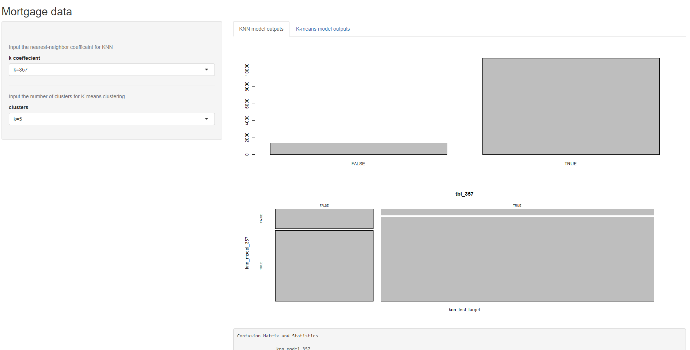
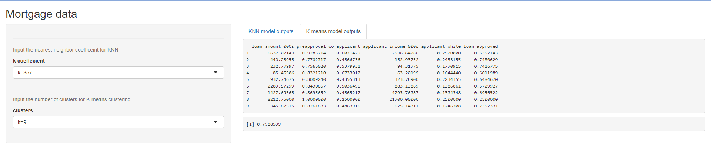

```{r setup, include=FALSE}
knitr::opts_chunk$set(echo = TRUE)
```

## Phase 1:  Problem statement

**Area of research:** Social issues surrounding racial tension in America.

**Title of project:** Does systemic racism exist in America?

**Potential clients:** People who wish to view the data about social disparities in America

**Potential sponsors:** People who wish to inform others of the existence (or non-existence) of social disparities in America

**Objective:** On the Oct. 7 2020, during the Vice Presidential debate, Mike Pence declared that systematic racism does not exist in America. My goal with this project is to aggregate data to prove or disprove that notion. I will try to do so by looking at the public data available and attempt to compare race vs arrests vs population size, race vs severity of crime vs incarceration rate/time, race vs mortgage loans denied/accepted, race vs income/job opportunities, race vs educational opportunities. In the end, I hope to be able to use this data to paint a very clear and coherent picture about social disparities in America, and aggregate it all in a very clean and concise place for all to view.


***

## Phase 2: Data Collection

### Crime Related Data sources

**Names of files:** 2019_FBI_arrests_by_race_total.csv
	    
2019_FBI_arrests_by_race_under18.csv 
			
2019_FBI_arrests_by_race_18_and_over.csv
			
**Source:** <https://ucr.fbi.gov/crime-in-the-u.s/2019/crime-in-the-u.s.-2019/topic-pages/tables/table-49>

**Details:** As the name suggests, this contains data about arrests in 2019. It contains details such as the race of the perpetrators and the type of crime they were arrested for.

### Finance Related Data sources

**Name of file:** NFWBS_PUF_2016_data_readable.csv

**Source:** <https://www.consumerfinance.gov/data-research/financial-well-being-survey-data/> 

**Details:** This is the National Financial Wellbeing Survey data from a survey that was conducted in 2016. This contains details about respondents and respondents’ financial well-being, including characteristics like income, age, race, savings, past financial experiences, financial skills, behaviors, attitudes ect. 
**Of note: The original file I downloaded was: NFWBS_PUF_2016_data.csv. I used NFWBS_PUF_2016_read_in_R.R to read the file and then write it into the more readable csv.

**Name of file:** hmda_2017_nationwide_all-records_labels.csv

**Source:** <https://www.consumerfinance.gov/data-research/hmda/historic-data/?geo=nationwide&records=all-records&field_descriptions=labels>

**Details:** This contains all the mortgage applications filed in 2017. It contains data about the applications and applicants, including details such as applicants’ demographics and whether the application was accepted or rejected.

### US Population Data source

**Name of file:** US_population_est_2010-2019.csv
**Source:** <https://www.census.gov/data/tables/time-series/demo/popest/2010s-national-detail.html#par_textimage_1537638156>

**Details:** Contains US population estimates from 2010-2019. Includes separation by race as well as the totals. 

#### UB box that contains my data:
<https://buffalo.box.com/s/9231grwf8pw2sjs5jhkvodavc6z21gt3>


***

## Phase 3: Data Cleaning

**Steps I have taken to clean my data:**

* Dropped irrelevant rows. 

  +	I have dropped rows using both the native “-“ operator and also the dplyr slice method. 
  
  + Dropped rows with NA values.
  
  ```{r eval = FALSE}
  #Getting rid of unnecessary rows/rows without data from the FBI arrest datasets
  intermediate_FBI_arrest_by_race_under18 <- 
      X2019_FBI_arrests_by_race_under18[-c(1:6,39:43),]
  intermediate_FBI_arrest_by_race_total <- 
      X2019_FBI_arrests_by_race_total %>% slice(-c(1:6,39:42),)
  intermediate_FBI_arrest_by_race_18_and_over <-
      na.omit(X2019_FBI_arrests_by_race_18_and_over) %>% slice(-c(32),)
  
  ```

* Dropped irrelevant columns.

  ```{r eval=FALSE}
#Removing irrelevant columns (features)
intermediate_FBI_arrest_by_race_total <- 
    select(intermediate_FBI_arrest_by_race_total, -c(14:19))
intermediate_FBI_arrest_by_race_under18 <- 
    select(intermediate_FBI_arrest_by_race_under18, -c(14:19))
intermediate_FBI_arrest_by_race_18_and_over <- 
    select(intermediate_FBI_arrest_by_race_18_and_over, -c(14:19))

  ```

* Changed column values so I can use them as column names

  +	I wanted to assign my first row to be column names (as that is how the data is mean to be read), however, as it stood, R wouldn’t let me do so because it wanted the column names to be unique, and the values in the first row were not unique.
  
  + So, I had to change the values (by adding “%” in front of values that need them) so that it can be read the way it was meant to be read 
  
  ```{r eval=FALSE}
  
  #Changing column values so I can use them as column names later
  indecies <- seq(8,13)
  for(i in indecies){
    "For each of the columns 8:13, 
    add a '%' sign in front of the values of the first row"
    val <- intermediate_FBI_arrest_by_race_total[1,i]
    intermediate_FBI_arrest_by_race_total[1,i] = paste("%",val)
  
    val <- intermediate_FBI_arrest_by_race_under18[1,i]
    intermediate_FBI_arrest_by_race_under18[1,i] = paste("%",val)
  
    val <- intermediate_FBI_arrest_by_race_18_and_over[1,i]
    intermediate_FBI_arrest_by_race_18_and_over[1,i] = paste("%",val)
}
  
  ```
 
* Assigned first row to be column names

  +	Instead of column names being just numbers, they are now properly labeled 
  
  + Also, the first row (which contained what are now the column names) is dropped as it becomes redundant here.
  
  ```{r eval=FALSE}
  
  #Assigning appropriate column names for ease of readability 
  names(intermediate_FBI_arrest_by_race_total) <- 
    intermediate_FBI_arrest_by_race_total[1,]
  names(intermediate_FBI_arrest_by_race_under18) <- 
    intermediate_FBI_arrest_by_race_under18[1,]
  names(intermediate_FBI_arrest_by_race_18_and_over) <- 
    intermediate_FBI_arrest_by_race_18_and_over[1,]

  #Dropping the first rows as they are no longer needed
  intermediate_FBI_arrest_by_race_total <- 
    intermediate_FBI_arrest_by_race_total[-c(1),]
  intermediate_FBI_arrest_by_race_under18 <- 
    intermediate_FBI_arrest_by_race_under18[-c(1),]
  intermediate_FBI_arrest_by_race_18_and_over <- 
    intermediate_FBI_arrest_by_race_18_and_over[-c(1),]
  
  ```
  
* Changed data values from character to numeric

  ```{r eval=FALSE}
  
    #Changing the data values from character to numeric
  intermediate_FBI_arrest_by_race_total[,2:13] <- 
    lapply(2:13, 
         function(x) as.numeric(intermediate_FBI_arrest_by_race_total[[x]]))
  intermediate_FBI_arrest_by_race_under18[,2:13] <- 
    lapply(2:13, 
         function(x) as.numeric(intermediate_FBI_arrest_by_race_under18[[x]]))
  intermediate_FBI_arrest_by_race_18_and_over[,2:13] <- 
    lapply(2:13, 
         function(x) as.numeric(intermediate_FBI_arrest_by_race_18_and_over[[x]]))
  
  ```
  
* Changed the first column from characters to factors
  
  + Both these last two changes were done to aide in analyzing during the EDA phase
  
  ```{r eval=FALSE}
  
  #Changing the first column into factors
  intermediate_FBI_arrest_by_race_total[,1] <- 
    lapply(1, 
         function(x) as.factor(intermediate_FBI_arrest_by_race_total[[x]]))
  intermediate_FBI_arrest_by_race_under18[,1] <- 
    lapply(1, 
         function(x) as.factor(intermediate_FBI_arrest_by_race_under18[[x]]))
  intermediate_FBI_arrest_by_race_18_and_over[,1] <- 
    lapply(1, 
         function(x) as.factor(intermediate_FBI_arrest_by_race_18_and_over[[x]]))
  
  ```
  
  
***


## Phase 4: EDA and Data Engineering

```{r, echo=FALSE, results='hide', warning=FALSE, message=FALSE}
#Author: Akash Ghose

library(dplyr)
library(readr)
library(ggplot2)

#load the cleaned data
FBI_arrest_by_race_total <- read_csv("cleaned_data/FBI_arrest_by_race_total.csv")
FBI_arrest_by_race_under18 <- read_csv("cleaned_data/FBI_arrest_by_race_under18.csv")
FBI_arrest_by_race_18_and_over <- read_csv("cleaned_data/FBI_arrest_by_race_18_and_over.csv")
mortgage_data <- read_csv("cleaned_data/mortgage_data.csv")


```

**List of EDA steps I have taken:**

  *	I have used

    +	Head()
 
    +	Tail()
  
    +	Summary()
  
    +	Colnames()
  
    +	View()
	
* In various places throughout this phase and throughout the previous data cleaning phase to get a better understanding of the data I’m dealing with and figure out what to do next. For example, head and tail were useful in figuring out quickly whether the top and bottom of the data were similar, whether there were any inconsistencies that needed to be dealt with. Summary() gave me a whole lot of useful information. To start, it would tell me quickly if the data I am dealing with numbers as it seems or characters. With my mortgage data, summary() told me that I have 51 NAs in my “cleaned” "mortgage_dataloan_amount_000s". It also told me that the minimum amount of loan requested was $1000 and maximum was $30,000,000, which I thought was interesting. Colnames() was needed because I realized that some of the column names were not what they seemed. For example, in my FBI arrests data, I see a column name as “Black or African American” when I look at it with view(), but the actual column name is "Black or\r\nAfrican\r\nAmerican". View() was used frequently not only to get a holistic idea of the raw data, but also to see if the changes I was making while cleaning was behaving the way I expected them to. 
   
* Used dplyr techniques such as:

  +	Select()
  
    +Select was used in a few different places primarily to drop columns that were unnecessary or those that became obsolete
  
  +	Slice()
	
    + Slice() was used a couple of times to get rid of unwanted rows
    
  +	%>%
  
    +	The pipe operator was used extensively throughout the last two phases for a multitude of reasons, including for simplicity and sake of readability
    
  +	Mutate()
  
    +	Was used to add my own column with information about all non-white races in my FBI arrest datasets
    
  +	Relocate()
  
    +	Was used to re-arrange the placement of my recently added column for readability purposes.
    
  ```{r}
  
  
  #Combine non-white races into a single column
  #Combine %non-whites into a single column
  #Drop first column because it is useless
  #relocate the new rows to a better position for readability
  alt_FBI_arrest_by_race_total <-FBI_arrest_by_race_total %>%
    mutate(Non_white = .[[5]]+.[[6]]+.[[7]]+.[[8]]) %>%
    mutate("% Non_white" = .[[11]]+.[[12]]+.[[13]]+.[[14]]) %>%
    select(-c(1)) %>%
    relocate(Non_white, .after = "White") %>%
    relocate("% Non_white", .after = "% White")
  alt_FBI_arrest_by_race_under18 <-FBI_arrest_by_race_under18 %>%
    mutate(Non_white = .[[5]]+.[[6]]+.[[7]]+.[[8]]) %>%
    mutate("% Non_white" = .[[11]]+.[[12]]+.[[13]]+.[[14]]) %>%
    select(-c(1)) %>%
    relocate(Non_white, .after = "White") %>%
    relocate("% Non_white", .after = "% White")
  alt_FBI_arrest_by_race_18_and_over <-FBI_arrest_by_race_18_and_over %>%
    mutate(Non_white = .[[5]]+.[[6]]+.[[7]]+.[[8]]) %>%
    mutate("% Non_white" = .[[11]]+.[[12]]+.[[13]]+.[[14]]) %>%
    select(-c(1)) %>%
    relocate(Non_white, .after = "White") %>%
    relocate("% Non_white", .after = "% White")
  
  ```
 
* Used the following techniques to create graphs:

  + Boxplot()
  
    +	I initially created the boxplot in hopes of learning some useful information about the loan amounts that were requested. I found none, so I moved on to geom_boxplot
    
  ```{r, echo=FALSE}
  
  mortgage_data <- select(mortgage_data, -c(1)) 

  boxplot(mortgage_data$loan_amount_000s, col="green")
  
  ```
    
  +	Geom_boxplot()
  
    +	After tinkering with this a little bit, I was able to graph something that actually showed me useful information

  ```{r, echo=FALSE}
  
  ggplot(mortgage_data, aes(y=loan_amount_000s, x=applicant_race_1, 
                            color=applicant_race_name_1)) + geom_boxplot()
  
  ```
    + As you can see, white people request more loans of higher amounts than other people, especially black people

  +	Geom_bar()
  
    +	The goem barplot was used to draw the number of loans that were accepted and denied and with colors to show much of it belonged to each race
  
  ```{r, echo=FALSE}
  
  ggplot(mortgage_data, aes(x=action_taken, color=applicant_race_name_1))+geom_bar()
  
  ```
  
  + These last two graphs show that even though white poeple request higher loan amounts, black people are still more likely to have their mortgage loan requests rejected.
    
    
    
    
***

## Phase 5: Modeling and Analysis

```{r phase05_source, message=FALSE, warning=FALSE, include=FALSE, results='hide'}

source("phase05.R")

```

**Modeling algorithms used:**

*Linear regression: *

  *	The intent while using this algorithm was to try and predict either the loan amount that would be requested or the applicant’s income, given the available information I have about the applicant
  
  *	I made 4 different models. 
  
  *	The first one tried to model loan vs the applicant’s income and applicant’s race, where the amount of loan requested was the output/what the model would be predicting, and income and race were the inputs. 

    +	The p-value from this model was very good, less than 2.2e-16, which tells me that my variables had a very high degree of relatability.
    
    +	However, the R-squared and Adjusted R-squared values were not that high, less than 0.3, which meant that my predictability power of my model was not that good.
    
  *	I tried to increase the R-squared by adding more variables for my second and third model, i.e. co-applicant’s presence and co-applicant’s race.
  
  * For my fourth lm model, I used loan amount requested, applicant’s race and presence of co-applicant to try and predict the applicant’s income.
  
  * I think the reason why my lm model does not have good predicting power is because, while there is significant correlation between all the variables (i.e. white people are more likely to request for larger loans than say black people, or people with higher incomes would ask for higher sums etc.), most people still just never ask for more than a few thousand dollars; they all cluster near the bottom.  
  
```{r LM chunk, echo=TRUE}
#LM - loan vs applicant_income and applicant_race
lm_model_00
summary(lm_model_00)
plot(lm_model_00)

#Going to add more variables to perhaps make the lm_model more accurate as a predictor
#LM - loan vs income level, applicant_income, applicant_race and presence of co_applicant
lm_model_01
summary(lm_model_01)
plot(lm_model_01)
#ggplot(lm_model_01) + aes(col=applicant_race_1)

#LM - loan vs income level, applicant_income, applicant_race and co_applicant_race
lm_model_02
summary(lm_model_02)
plot(lm_model_02)

#Going to try using the LM algorithm to try to predict income instead
lm_model_03
summary(lm_model_03)
plot(lm_model_03)

```


*KNN Classification:*

  *	I wanted to use the KNN classification algorithm to try and see if I could make a model which could predict whether a loan would be approved or denied, given the loan amount requested, the applicant’s income, race and presence of co-applicant

  *	I took several steps to further clean my data to prepare for this process, including (but not limited to) normalizing my data so that they are all on the same scale (0 to 1).

  *	I used roughly 90% of my data to train the model and 10% to test it
  
  *	I made two models: one with a NN coefficient (k) of 357, which is roughly the square root of my total observations and one where k is 5 to see if one of them was better than the other
  
  *	I used a confusion matrix to determine the accuracy of my models. 
    
    +	I found that my first model, where K=357, was more accurate than my other model

    +	Model_00 was accurate roughly 74.3% of the time, where as model_01 was accurate only 68.6% of the time

    +	I chose to stick with model_00, but either way, they were both decently accurate.
 

```{r KNN_chunk, echo=TRUE}

#knn_model_00
#K = 357
plot(knn_model_00)
plot(tbl_00)
confusionMatrix(tbl_00)

#K = 5
plot(knn_model_01)
tbl_01
confusionMatrix(tbl_01)

```
 
 
*KMeans:*

  *	I used this algorithm in hopes of organizing my data into similar clusters so that I may be able to extrapolate some useful insights from these clusters.

  *	I made a few different models. The first one I built; I initially used the normalized dataset I used for my KNN classification.
    
    +	While this model had was the best fit of the models I tried (had the highest between_SS / total_SS, 75.1 %), it did not allow for any useful interpretation of the data. At least none that I could find.
    
  *	So then, I tried making a couple different models with non-normalized knn-data with 5 clusters (the number 5 was chosen arbitrarily).
    
    +	These models were not as good of a fit as my first one (between_SS / total_SS = 66.4%), but in model_02, I found that loan amounts clustered around 347,000 had the highest rate of approval, which I found was interesting. 
    
```{r KMeans_chunk, echo=TRUE}
kmeans_model_01$size
kmeans_model_01$centers
kmeans_model_01$betweenss/kmeans_model_00$totss

kmeans_model_02$size
kmeans_model_02$centers
kmeans_model_02$betweenss/kmeans_model_00$totss   

```


***

## Phase 6: Building a Data Product

**NOTE:** In order to run my shiny app, make sure you manually run either the phase06.R script or the source() function in app.R. This will take some time due to the size of the data, so give it a minute.

My Rshiny code is fairly simple. It is organized into 4 files: ui.R, server.R, phase06.R and finally app.R to bring it all together. 
The job of my ui file is to simply allocate to me room on the screen to insert input and to draw my outputs. The inserting input part of its job is achieved in the sidebarPanel via the two selectInput functions I have in it. The output(s) are displayed in the mainPanel via my uiOutput(‘tabs’) function. The inputs in this case are the number of nearest neighbors to consider for my knn models and the number of clusters for my k-means models. 

The server.R has the primary function of reading the input and figuring out which model(s) to run and what to output. For the knn models, I am displaying the plot of the knn model, a confusion-matrix in table form and the analysis of the confusion matrix. For my k-means models, I am displaying the centers that the clusters have formed and the goodness of the model (as calculated by between_ss/total_ss) as these are the variables I’m most interested in. 

The phase06.R is where most of the heavy lifting for this app is done; this is where the models are calculated. This was supposed to be done in the server.R file so as to make my app even more dynamic, however, R shiny was having issues performing these calculations due to the size of my data. Therefore, I had to make the calculations separately and beforehand, rather than dynamically via R shiny. 

App.R is where I can execute all the necessary files with ease. 

```{r picture_0, echo=FALSE}



```

```{r picture_1, echo=FALSE}



```

```{r phase06_source, eval=FALSE, message=FALSE, warning=FALSE, include=FALSE, paged.print=FALSE}
#source("phase06.R")

library(shiny)


ui <- fluidPage(
  
  # Application title
    titlePanel("Mortgage data"),

    sidebarLayout(
        sidebarPanel(
          list(hr(), 
               helpText("Input the nearest-neighbor coefficeint for KNN"),
               selectInput(inputId = "k", label = "k coeffecient",
                           choices = c("k=4","k=5", "k=6", 
                                       "k=356", "k=357", "k=358"),
                           selected = "k=357")
               ),
          list(hr(), 
               helpText("Input the number of clusters for K-means clustering"),
               selectInput(inputId = "clust", label = "clusters",
                           choices = c("k=3","k=4", "k=5", 
                                       "k=6", "k=7", "k=8", "k=9"),
                           selected = "k=5")
          )
        ),

        # Show a plot of the generated distribution
        mainPanel(
            uiOutput("tabs")
        )
    )
  
)

server <- function(input, output, session) {
  
  output$knn <- renderPlot({
      if(input$k == "k=358"){plot(knn_model_358)}
      if(input$k == "k=357"){plot(knn_model_357)}
      if(input$k == "k=356"){plot(knn_model_356)}
      
      if(input$k == "k=6"){plot(knn_model_6)}
      if(input$k == "k=5"){plot(knn_model_5)}
      if(input$k == "k=4"){plot(knn_model_4)}

    })
    
    output$knn_tbl <- renderPlot({
      if(input$k == "k=358"){plot(tbl_358)}
      if(input$k == "k=357"){plot(tbl_357)}
      if(input$k == "k=356"){plot(tbl_356)}
      
      if(input$k == "k=6"){plot(tbl_6)}
      if(input$k == "k=5"){plot(tbl_5)}
      if(input$k == "k=4"){plot(tbl_4)}
      
    })
    
    output$knn_cmtx <- renderPrint({
      if(input$k == "k=358"){confusionMatrix(tbl_358)}
      else if(input$k == "k=357"){confusionMatrix(tbl_357)}
      else if(input$k == "k=356"){confusionMatrix(tbl_356)}
      
      else if(input$k == "k=6"){confusionMatrix(tbl_6)}
      else if(input$k == "k=5"){confusionMatrix(tbl_5)}
      else if(input$k == "k=4"){confusionMatrix(tbl_4)}
      
    })
    
    output$kmeans_cntrs <- renderPrint({
      if(input$clust == "k=3"){kmeans_model_03$centers}
      else if(input$clust == "k=4"){kmeans_model_04$centers}
      else if(input$clust == "k=5"){kmeans_model_05$centers}
      else if(input$clust == "k=6"){kmeans_model_06$centers}
      else if(input$clust == "k=7"){kmeans_model_07$centers}
      else if(input$clust == "k=8"){kmeans_model_08$centers}
      else if(input$clust == "k=9"){kmeans_model_09$centers}
    })
    
    output$kmeans_goodness <- renderPrint({
      if(input$clust == "k=3"){kmeans_model_03$betweenss/kmeans_model_03$totss}
      else if(input$clust == "k=4"){kmeans_model_04$betweenss/kmeans_model_04$totss}
      else if(input$clust == "k=5"){kmeans_model_05$betweenss/kmeans_model_05$totss}
      else if(input$clust == "k=6"){kmeans_model_06$betweenss/kmeans_model_06$totss}
      else if(input$clust == "k=7"){kmeans_model_07$betweenss/kmeans_model_07$totss}
      else if(input$clust == "k=8"){kmeans_model_08$betweenss/kmeans_model_08$totss}
      else if(input$clust == "k=9"){kmeans_model_09$betweenss/kmeans_model_09$totss}
    })
    
    output$tabs <- renderUI(
      tabsetPanel(
        tabPanel("KNN model outputs", 
                 plotOutput("knn"),
                 plotOutput("knn_tbl"),
                 verbatimTextOutput("knn_cmtx")),
        tabPanel("K-means model outputs",
                 verbatimTextOutput("kmeans_cntrs"),
                 verbatimTextOutput("kmeans_goodness"))
      )
    )
  
}

shinyApp(ui, server)

```

## Phase 7: Documenting and Reporting

To document what I have done and to report my outcomes, I have made this html document using R markdown

***
